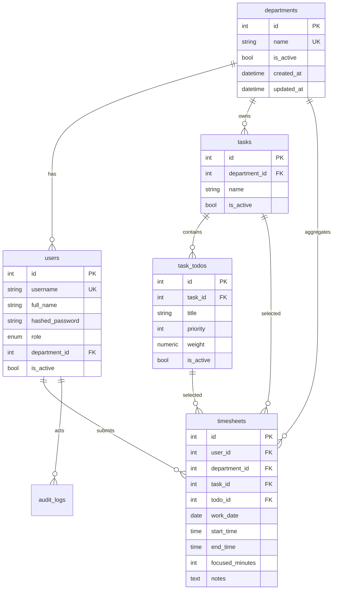

# Enterprise Timesheet & Productivity Analytics Platform

زبان رابط کاربری: فارسی، راست‌به‌چپ، با پشتیبانی Dark Mode.

## 1. Complete Project Architecture

Monolith-friendly architecture for ~100 employees:

```text
Browser / Mobile
  -> Nginx reverse proxy
    -> Next.js App Router frontend
    -> FastAPI backend
        -> PostgreSQL
```

Services in Docker Compose: `frontend`, `backend`, `postgres`, `nginx`.

Primary modules:
- Auth: username/password, bcrypt, JWT.
- RBAC: Admin, Manager, Employee.
- Departments: flexible future departments.
- Task Mapping Import: Excel `Task`, `To Do`, `Priority`, `Weight`.
- Timesheets: daily entries, overlap validation, same-day deadline.
- Analytics: personal, department, manager, admin reporting.
- Audit logs: security-sensitive actions.

## 2. Database Schema

Tables:
- `departments(id, name, is_active, created_at, updated_at)`
- `users(id, username, full_name, hashed_password, role, department_id, is_active, created_at, updated_at)`
- `tasks(id, department_id, name, is_active, created_at, updated_at)`
- `task_todos(id, task_id, title, priority, weight, is_active, created_at, updated_at)`
- `timesheets(id, user_id, department_id, task_id, todo_id, work_date, start_time, end_time, focused_minutes, notes, created_at, updated_at)`
- `department_metrics(id, department_id, metric_date, avg_hours, avg_focus_rate, productivity_score, created_at, updated_at)` optional materialized daily aggregate.
- `audit_logs(id, actor_id, action, entity_type, entity_id, metadata, created_at, updated_at)`

Sensitive fields hidden from employees:
- `task_todos.priority`
- `task_todos.weight`

## 3. ERD



## 4. Backend Structure

```text
backend/
  app/
    main.py
    core/config.py
    core/security.py
    db/base.py
    db/session.py
    models/
    schemas/
    api/deps.py
    api/routes/
      auth.py me.py tasks.py timesheets.py analytics.py manager.py admin.py
    services/
      audit.py excel_import.py kpi.py
  alembic/
  requirements.txt
  Dockerfile
```

## 5. Frontend Structure

```text
frontend/
  app/
    layout.tsx          # fa + dir=rtl
    globals.css
    login/page.tsx
    dashboard/page.tsx
    manager/page.tsx
    admin/page.tsx
  components/
    Shell.tsx KpiCard.tsx Charts.tsx
  lib/api.ts
  tailwind.config.ts
  Dockerfile
```

UI principles:
- Linear/Stripe/Notion-inspired minimal cards.
- White/light-gray surfaces with dark-blue accent `#0B3A75`.
- Avoid crowded dashboards.
- All visible copy is Persian.
- Never display priority/weight.

## 6. API Specification

Auth:
- `POST /auth/login` -> JWT.
- `GET /me` -> current user.

Employee:
- `GET /tasks` -> department tasks only; no priority/weight.
- `GET /tasks/{id}/todos` -> task to-do items only; no priority/weight.
- `POST /timesheets` -> create daily record.
- `GET /timesheets/history` -> personal history.
- `GET /analytics/me` -> personal KPIs and department averages.

Manager:
- `GET /analytics/department`
- `GET /manager/team`

Admin:
- `POST /admin/users`
- `POST /admin/departments`
- `POST /admin/import-tasks/preview`
- `POST /admin/import-tasks`

OpenAPI is available at `/docs` and `/openapi.json`.

## 7. Docker Setup

Run locally:

```bash
cp .env.example .env
# edit secrets
sudo docker compose up --build
```

URLs:
- App: `http://localhost`
- API docs: `http://localhost/docs`

## 8. Authentication Flow

1. User submits username/password.
2. Backend verifies bcrypt password hash.
3. Backend issues signed JWT with `sub` and `role`.
4. Frontend stores token and sends `Authorization: Bearer <token>`.
5. Backend dependency loads active user and applies RBAC.

Production hardening:
- Prefer HttpOnly Secure cookie for JWT if public internet exposure is expected.
- Short access token lifetime + refresh token rotation if required.
- Enforce TLS at load balancer/nginx.

## 9. KPI Calculation Formulas

Definitions:
- Total Duration = `end_time - start_time` in minutes.
- Focus Rate = `focused_minutes / total_minutes`.
- Daily Working Hours = `sum(total_minutes) / 60`.
- Average Daily Working Hours = `sum(total_minutes) / 60 / active_days`.
- Monthly Focus Rate = `sum(focused_minutes) / sum(total_minutes)`.

Productivity Score, normalized 0-100:

```text
raw = Σ(weight * priority * focus_rate * hours_invested)
max = Σ(weight * priority * hours_invested)
score = min(100, raw / max * 100)
```

Rationale:
- `priority` and `weight` affect backend score only.
- Employees see final score, not internal priority/weight.
- Time invested matters but poor focus lowers score.

## 10. Excel Import Engine

Required Excel columns:
- `Task`
- `To Do`
- `Priority`
- `Weight`

Flow:
1. Admin uploads `.xlsx`.
2. Backend reads using pandas/openpyxl.
3. Validate required columns.
4. Preview first 20 rows.
5. Upsert tasks by `(department_id, task_name)`.
6. Upsert todos by `(task_id, title)`.
7. Save priority/weight internally.
8. Write audit log.

## 11. Dashboard Wireframes

Employee dashboard:

```text
[Top nav: سامانه بهره‌وری | داشبورد | مدیر | ادمین]

[میانگین ساعات روزانه] [نرخ تمرکز] [امتیاز بهره‌وری]

[Line: روند ساعات کاری]      [Line: روند درصد تمرکز]
[Area: بهره‌وری ماهانه]      [Pie: توزیع زمان وظایف]
[Bar: عملکرد دسته‌بندی]      [Bar: شما در برابر میانگین دپارتمان]
```

Manager dashboard:

```text
[Total Employees] [Avg Hours] [Avg Focus] [Productivity]
[Team productivity trend] [Department focus trend]
[Task distribution] [Monthly growth]
[Heatmap productive/unproductive days]
[Team ranking table]
```

Admin dashboard:

```text
[Users] [Departments] [Task Imports]
User table + status
Department table
Excel upload -> preview -> validate -> import
Audit log
```

## 12. Implementation Roadmap

Phase 1 — Foundation:
- Docker, PostgreSQL, FastAPI, Next.js.
- Alembic migrations.
- Auth/RBAC.

Phase 2 — Core Timesheet:
- Task mapping import.
- Employee entry form.
- Deadline, overlap, focus validations.

Phase 3 — Analytics:
- Personal KPIs.
- Department averages.
- Manager team ranking.
- Recharts dashboards.

Phase 4 — Admin:
- User CRUD.
- Department CRUD.
- Import preview and audit log UI.

Phase 5 — Production:
- TLS, backups, CI/CD.
- Observability, structured logging.
- Security review and rate limits.

## 13. Production Deployment Guide

Checklist:
- Set strong `SECRET_KEY` and PostgreSQL password.
- Put application behind TLS.
- Enable database backups and restore drills.
- Restrict `/docs` in production or protect it.
- Configure log retention.
- Use least-privilege database user.
- Run migrations before releasing.
- Add monitoring for API 5xx, DB health, disk space.
- Review audit logs regularly.

Deployment:

```bash
git pull
cp .env.example .env
nano .env
docker compose build
docker compose up -d
# verify
docker compose ps
curl http://localhost/api/health
```

Database backup:

```bash
docker compose exec postgres pg_dump -U timesheet timesheet > backup.sql
```

Restore:

```bash
cat backup.sql | docker compose exec -T postgres psql -U timesheet timesheet
```
